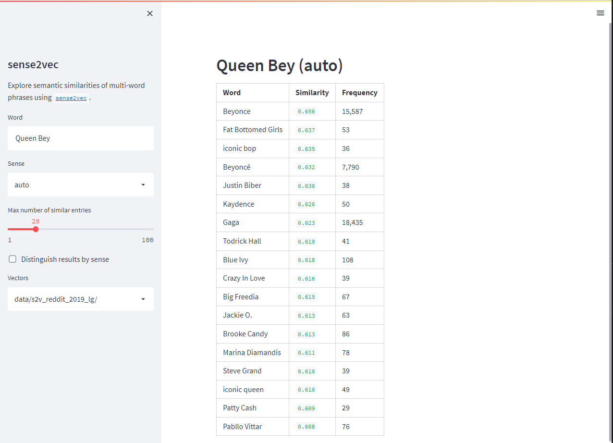

This is a minimal app which uses [Streamlit](https://streamlit.io/) to enable querying of the most recent Reddit-trained [sense2vec](https://github.com/explosion/sense2vec) model.



It is mainly useful to see how quicky and simply a useable dashboard can be created using these tools.

Note that this is ripped directly from code published by Explosion - I just wanted to see it all in one place, and use it as a template.

To run (from the home directory, assuming python==3.7 or higher):

```bash
python3 -m venv .streamlit_env
source .streamlit_env/bin/activate
pip3 install -r requirements.txt
sh get_data.sh
streamlit run streamlit_sense2vec.py data/s2v_reddit_2019_lg/
```

You should then be able to go to localhost:8501 to view the app.